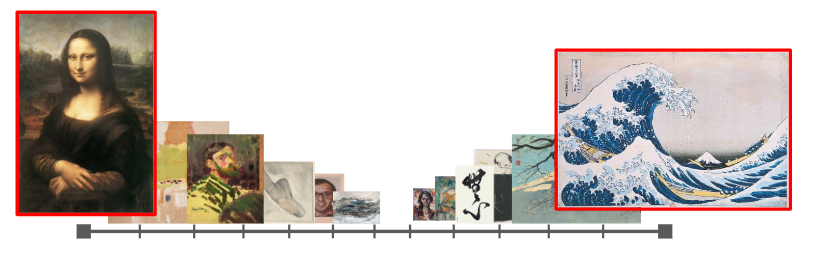

# MoMA-Artwork-Classification

The goal of this study is to use image processing techniques to extract the latent features of a collection of artworks from the MoMA with hopes to determine which characteristics of the work can be classified by latent features (e.g. Nationality, Medium, Time Period).

## Instructions to use

Pull the project code and CSV file to your local machine.
Run the code using MATLAB (development done using R2019a)
In order to change nationalities, uncomment the two nationalities you wish to compare in lines 16-18 and replace the variables in line 19 accordingly. For example, to compare French and Japanese artworks:

% idx1 = find(nat_grps == 1); %American     %line 16

idx27 = find(nat_grps == 27); %French       %line 17

idx42 = find(nat_grps == 42); %Japanese     %line 18

idx = [idx27(1:end/2);idx42(1:end)];        %line 19
